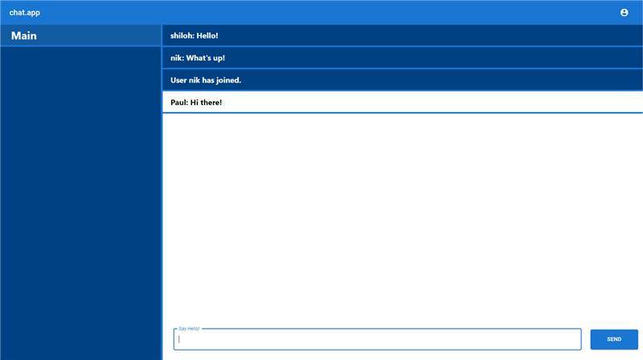

# chat.app
## Table of contents
* [Overview](#overview)
* [Features](#features)
* [Technology](#technology)
* [Launch](#launch)
* [Presentation](#https://docs.google.com/presentation/d/1DtHGu1nQyMW9cDrIe7_yIe1CMYN7Ioe8qPtaO4vjFDI/edit?usp=sharing)

### Overview
This app was created for chat messaging.



### Features
* Private accounts
* Group messaging
* Message deleting (for admins)


### Technology
Project is created using SQL, Java, JS, AWS, Web sockets, React MUI, and Node.


### Launch 
To launch this project, clone this repo to your desktop.<br />
Go to the project's root directory and install dependencies with npm.<br />
Once installed, use `npm start` to start the application.<br />
Access the application at localhost:3000.<br />

```
$ cd ../capstone-dev10
$ npm install
$ npm start
```
